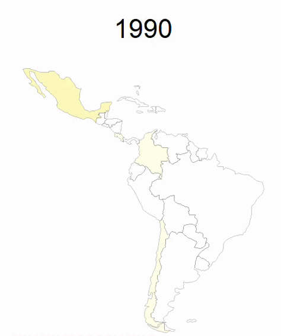

```{r setup, include=FALSE}
knitr::opts_chunk$set(echo = TRUE)
```

```{r, include=FALSE}
library(tidyverse)
library(dplyr)
library(readxl)
library(psych)
library(patchwork)
library(tmap)
library(sf)  
library(scales)
library(ggplot2)
library(patchwork) 
library(hrbrthemes)
library(modelsummary)
library(gridExtra)

clean_data <- read.csv("datasets/ocde_data.csv")


```

<style>
body {
text-align: justify}
</style>


## Introducción

La inflación como fenómeno de estudio ha captado la atención de las investigaciones contemporáneas tomando en cuenta sus posibles orígenes. Particularmente, en épocas de inestabilidad económica, como la crisis financiera de 2008 y, más recientemente el COVID-19, se ha reafirmado la importancia del Gasto Público para hacer frente a los temas sociales, los cuales tienen un impacto en cuanto a gobernabilidad y estabilidad de los países.

Existen dos ideas contrapuestas respecto a los efectos del gasto público en la inflación: que el gasto público genera incrementos en la inflación y que el nivel de gasto público no actúa como causa eficiente de la inflación (Lascano, s.f). Con el fin de contrastar ambas posiciones, el presente informe tiene como finalidad realizar un análisis descriptivo respecto al gasto público y su relación con el comportamiento de la inflación, ello tomando en cuenta los países de América Latina que son miembros de la OCDE. Del tópico de interés se desprenden las siguientes interrogantes, a las que se busca dar respuesta:

* ¿Existe una correlación entre el gasto público y la inflación en los países?
* ¿En qué magnitud afecta el gasto público a la inflación?
* ¿En qué medida el COVID-19 impactó el nivel de gasto per cápita entre países? 


El presente análisis trata darle una respuesta a la interrogante de si realmente tiene un papel explicativo el gasto público en la inflación desde la perspectiva de cuatro países latinoamericanos pertenecientes a una organización internacional que se dedica al diseño de políticas direccionadas al bienestar y desarrollo. Estos países al pertenecer a esta organización tienen una serie de características y comportamientos, ya que la misma pide una serie de requisitos para poder entrar, y existen una serie de lineamientos y restricciones macroeconómicas a seguir una vez que perteneces, lo cual facilita el análisis según las limitaciones del estudio ya que parametriza en cierto sentido la muestra. En este sentido, considerando estos estándares a seguir, es interesante observar cómo se comportaría la variable a analizar según las flexibilizaciones dadas por esta organización, el nivel de gasto y el papel que juega en la inflación de estos países con la pandemia. 

Es importante aclarar que esta investigación exploratoria no tiene como objetivo determinar las causas de la inflación, sino establecer una relación entre variables y analizar cuál ha sido el comportamiento del gasto público per cápita entre países luego de 2020. No se pretende establecer relaciones causales, ya que no se tomarán en cuenta otras variables relevantes para el estudio del fenómeno macroeconómico. 


## Metodología
Para llevar a cabo el estudio, empleamos la  [base de datos obtenida del Fondo Monetario Internacional](https://www.imf.org/en/Publications/WEO/weo-database/2022/April/weo-report?c=228,233,238,273,&s=PPPEX,PCPI,LP,GGX,&sy=1990&ey=2021&ssm=0&scsm=1&scc=0&ssd=1&ssc=0&sic=0&sort=country&ds=.&br=1).

Se hizo uso de las siguientes variables  de los países Colombia, Chile, Costa Rica y México para el período comprendido entre los años 1990 y 2021:

- Población
- Gasto público (Miles de millones en moneda nacional) 
- Inflación (Índice de Precios al Consumidor) 
- Tasa implícita del PPA (Unidades monetarias por dólar americano) 


Previo al análisis de los datos, se realizó una transformación de los mismos. La misma consistió en la limpieza y recopilación de los datos en una tabla unificada, así como cálculos adicionales de indicadores que permitieron realizar un análisis preciso. Asimismo, el proceso de limpieza de datos permitió transformar los valores que fueron evaluados, omitiendo aquellas observaciones que no sean de utilidad para las variables definidas.Uno de los cálculos más importantes que se realizaron dentro de la transformación de los datos es el del  gasto público por país en dólares americanos, con el fin de estandarizar los valores entre países. De igual manera, se realizó el cálculo del gasto público per cápita por cada país, para así poder determinar la proporción del gasto destinado a cada habitante. 

Para dar respuesta a las incógnitas de investigación, se hizo uso del análisis descriptivo de los indicadores previamente mencionados, un análisis de correlación entre variables, así como un análisis de regresión lineal en el que se explica la inflación en función del gasto público. Tanto para cada país de la muestra seleccionada, como a nivel agregado de la misma, se estimaron la siguientes regresiones de Mínimos Cuadrados Ordinarios: 


$$IPC_{ij} =  \beta_{0} + \beta_{1}Gasto_{ij} + \epsilon_{ij}
$$


$$IPC_{ij} =  \beta_{0} + \beta_{1}Gastopc_{ij} + \epsilon_{ij}$$


Donde IPC es la inflación, Gasto es el gasto público del país medido en dólares americanos, Gastopc es el gasto público per cápita del país medido en dólares americanos. Así como i hace referencia a cada uno de los países de la muestra y, j hace referencia a cada uno de los años en el rango de 1990 a 2021. Cabe destacar que los datos a analizar son datos de panel, es decir, las observaciones de cada país cambian a través del tiempo. El uso de regresiones de MCO nos permitió estimar los coeficientes explicativos de las relaciones entre ambas variables para así poder explicar la relación existente entre ambas variables para la muestra especificada. Si bien esta metodología nos permite observar las relaciones, no se puede afirmar existencia de causalidad de la inflación por parte del gasto público. 


Adicionalmente, se emplearon herramientas de visualización de datos para presentar las relaciones estudiadas, histogramas para el análisis de la distribución, además de ilustraciones comparativas que complementen el análisis que se llevó a cabo. Lo anterior se realizó con el fin de analizar la información obtenida y aproximar así el comportamiento que evidencia el fenómeno planteado. 


## Análisis

El proceso de limpieza y transformación de datos fue relativamente sencillo, ya que la base de datos original no poseía datos faltantes. Una vez descargados los datos del sitio web del Fondo Monetario Internacional, nos percatamos que el monto de gasto público estaba expresado en moneda nacional. Por lo tanto, uno de los cálculos realizados fue el cálculo del gasto público en dólares, usando el valor del PPP en conjunto con el valor del gasto público en moneda nacional. Adicionalmente, agregamos a la base de datos la variable del gasto público per cápita. Este cálculo fue realizado usando las variables del gasto público en dólares y la variable de población.

Para dar respuesta a las interrogantes planteadas, construimos un conjunto de visualizaciones que permiten observar fácilmente los incrementos a nivel del gasto público para todos los países pertenecientes a la OCDE ante el COVID-19. Además, se presenta en una tabla resumen las correlaciones entre el gasto público y la inflación así como el gasto público per cápita y la inflación.

A continuación se presentan las visualizaciones realizadas con su respectivo análisis. Sin embargo, omitimos una gráfica múltiple que intentamos realizar en la que se podía observar la evolución en el período 1990-2021 del gasto público en dólares (gráfico de línea) y la tasa de crecimiento poblacional (gráfico de barras).  

### Visualizaciones

```{r, echo=FALSE, fig.align='center'}

clean_data %>%
  ggplot(aes(Ano, gasto_dolares, color = Country)) + 
  geom_line() + ggtitle("Gasto de los Paises OCDE en LATAM") +
  geom_vline(xintercept = 2020) +
  xlab("Año") + ylab("Gasto (Mil Millones de USD)")

```

En el gráfico puede evidenciarse un incremento sostenido en el gasto público para los países que son objeto de estudio. Particularmente, en el año 2020, con la llegada del COVID-19 se aprecia un punto de inflexión en dicho aumento, el cual no es tan visible en el caso de Costa Rica, y ello obedece a las medidas extraordinarias que tomaron los gobiernos para hacer frente a la crisis sanitaria, las cuales estuvieron respaldadas por organismos como la OCDE, los cuales flexibilizaron sus estándares respecto al manejo y destino de los recursos públicos. En definitiva, la trayectoria del gasto público debe comprenderse en función de los objetivos y limitaciones que tienen las autoridades de los países estudiados, por tanto, se recomienda que los determinantes que explican el comportamiento reflejado se analicen en estudios futuros para mayor especificidad. 


```{r, echo=FALSE, fig.align='center'}

clean_data %>%
  ggplot(aes(Ano, gastopc, color = Country)) + 
  geom_line() + ggtitle("Gasto per Cápita Países OCDE LATAM") +
  geom_vline(xintercept = 2020) +
  xlab("Año") + ylab("Gasto per Cápita")

```

El crecimiento de la población implica desafíos en materia económica, ya que los niveles de gasto deben corresponderse con estas demandas y necesidades en ascenso. Para efectos del presente estudio, desde 1990 se evidencia una tendencia al alza del gasto per cápita de los países miembros de la OCDE en América Latina, teniendo un punto de inflexión en el 2020 con la llegada del COVID-19, ya que se refleja un crecimiento más acelerado del gasto. Para comprender este comportamiento, resulta necesario valorar algunos aspectos fundamentales: i) condiciones internas, que incluyen procesos de reforma, estructura tributaria y planes de desarrollo de los países estudiados; ii) condiciones externas, que comprende la exposición a shocks externos de cada país, y su capacidad para generar divisas y reinvertirlas en los programas públicos. Sin embargo, como se ha mencionado anteriormente, las causas que dan cuenta de estos comportamientos escapan de los objetivos de este estudio, por tanto, para mayor especificidad habría que revisar a profundidad las particularidades de cada economía. 


<center>

</center>

### Comportamiento del Gasto en Chile

```{r, echo=FALSE,  fig.show='hold', out.width="50%"}
# Para Chile

clean_data %>%
  filter(Country == 'Chile') %>% 
  ggplot(aes(Ano, gasto_dolares, color = Country)) + 
  geom_line() + ggtitle("Comportamiento del Gasto en Chile") +
  geom_vline(xintercept = 2009) + 
  xlab("Año") + ylab("Gasto (Mil Millones de USD)")


clean_data %>% 
  filter(Country == 'Chile') %>% 
  `rownames<-`(.$Ano) %>% 
  select(gasto_dolares, ipc) %>% 
  scatterHist(title= "Resumen descriptivo Gasto-IPC en Chile",
              xlab = "IPC",
              ylab = "Gasto (Mil Millones de USD)")


```

El gasto en Chile ha presentado una tendencia creciente del gasto público, la cual puede tener una mayor o menor rapidez a lo largo de la trayectoria temporal estudiada. A partir del año 2009, en el que Chile ingresa oficialmente como país miembro de la OCDE, puede notarse mayores niveles del gasto respecto a periodos precedentes, y para ello resultaría conveniente valorar aspectos como los distintos programas de gobierno y reformas alcanzadas, reformas asumidas por el país para el proceso de adhesión y sus efectos a posteriori, además de los presupuestos aprobados en el país y su alcance respecto a sus principales destinos. En términos de correlación, podemos ver que los datos se mueven dentro de los límites de la bondad de ajuste, lo cual es un indicador de que estos son en su mayoría, representativos de la población de datos y al tener un coeficiente R tan cercano a 1 podemos afirmar que en Chile una alta correlación entre el gasto público y la inflación.

### Comportamiento del Gasto en Colombia

```{r, echo=FALSE,  fig.show='hold', out.width="50%"}

# Para Colombia

clean_data %>%
  filter(Country == 'Colombia') %>% 
  ggplot(aes(Ano, gasto_dolares, color = Country)) + 
  geom_line() + ggtitle("Comportamiento del Gasto en Colombia") +
  geom_vline(xintercept = 2013) + 
  xlab("Año") + ylab("Gasto (Mil Millones de USD)") + labs(caption = "Nota: el año corresponde a la aprobación de la adhesion y hoja de ruta")


clean_data %>% 
  filter(Country == 'Colombia') %>% 
  `rownames<-`(.$Ano) %>% 
  select(gasto_dolares, ipc) %>% 
  scatterHist(title= "Resumen descriptivo Gasto-IPC en Colombia",
              xlab = "IPC",
              ylab = "Gasto (Mil Millones de USD)")

```

En el caso de Colombia se tiene una tendencia creciente del gasto, consistente con el comportamiento presentado en el resto de los países estudiados. Ahora bien, este país tuvo su ingreso formal como miembro pleno de la OCDE en el año 2020, pero para fines prácticos, se consideró el año 2013, cuando la organización aprobó la hoja de ruta para el país. A partir de este punto, pueden visualizarse mayores niveles de gasto respecto a periodos anteriores, hasta llegar a 2018, donde puede observarse un comportamiento estable e incluso con tendencia a la baja hasta 2020, en donde retorna a su crecimiento. Adicionalmente al programa de reformas ejecutado durante estos periodos previos a la adhesión formal, habría que revisar las metas trazadas durante los gobiernos de Juan Manuel Santos e Iván Duque en 2018, para medir con mayor profundidad los posibles determinantes de estos comportamientos. Para el análisis de correlación de Colombia, el resultado es un coeficiente de 0.96, lo cual también afirma que para este país también existe una alta correlación entre las variables estudiadas. Esto apegados a la confiabilidad de los datos ya que se encuentran dentro de los límites de r2, dando como resultado que son representativos la investigación.

### Comportamiento del Gasto en Costa Rica

```{r, echo=FALSE,  fig.show='hold', out.width="50%"}

# Para Costa Rica

clean_data %>%
  filter(Country == 'Costa Rica') %>% 
  ggplot(aes(Ano, gasto_dolares, color = Country)) + 
  geom_line() + ggtitle("Comportamiento del Gasto en Costa Rica") +
  geom_vline(xintercept = 2015) + 
  xlab("Año") + ylab("Gasto (Mil Millones de USD)") + labs(caption = "Nota: el año corresponde a la aprobación de la adhesion y hoja de ruta")

clean_data %>% 
  filter(Country == 'Costa Rica') %>% 
  `rownames<-`(.$Ano) %>% 
  select(gasto_dolares, ipc) %>% 
  scatterHist(title= "Resumen descriptivo Gasto-IPC en Costa Rica",
              xlab = "IPC",
              ylab = "Gasto (Mil Millones de USD)")

```

El comportamiento evidenciado en Costa Rica reitera la tendencia creciente, continua y sostenida presentada en los demás países estudiados. Para el año 2015, en el que la OCDE aprobó la hoja de ruta para la adhesión oficial del país, los niveles de gasto son superiores respecto a periodos anteriores, ello en correspondencia con el paralelo proceso de reformas que ha debido realizar el país para oficializar su ingreso a la organización. Como bien se ha mencionado, los alcances del estudio se limitan a reflejar el comportamiento del gasto mediante la observación preliminar, por lo que para mayor especificidad se recomienda revisar las reformas implementadas por el país, su estructura tributaria, los presupuestos aprobados y las metas fijadas por los gobiernos en relación con el destino del gasto público a nivel sectorial. En este caso, a pesar de tener los datos un poco más dispersos que en los casos anteriores, aún se encuentran en los límites de r2 y arroja un coeficiente de correlación elevado de 0.92.

### Comportamiento del Gasto en México

```{r, echo=FALSE,  fig.show='hold', out.width="50%"}

# Para Mexico


clean_data %>%
  filter(Country == 'Mexico') %>% 
  ggplot(aes(Ano, gasto_dolares, color = Country)) + 
  geom_line() + ggtitle("Comportamiento del Gasto en Mexico") +
  geom_vline(xintercept = 1994) + 
  xlab("Año") + ylab("Gasto (Mil Millones de USD)")


clean_data %>% 
  filter(Country == 'Mexico') %>% 
  `rownames<-`(.$Ano) %>% 
  select(gasto_dolares, ipc) %>% 
  scatterHist(title= "Resumen descriptivo Gasto-IPC en México",
              xlab = "IPC",
              ylab = "Gasto (Mil Millones de USD)")  

```

El caso de México resulta particular ya que fue el primer país de América Latina en adherirse oficialmente a la OCDE, siendo su ingreso efectivo en 1994. En este sentido, puede notarse que la tendencia ha sido al alza durante el periodo estudiado, con ciertos momentos de recortes que habría que revisar a profundidad en un estudio futuro dedicado a este punto específico. Asimismo, es conveniente destacar que en virtud de la adhesión temprana ya comentada, el contexto dinámico de la economía mundial durante el siglo XXI y los distintos gobiernos con sus prioridades en materia de políticas públicas, sugieren a priori haber incidido en el comportamiento del gasto, ya que los estándares de la organización, así como las normas marco en distintas áreas se han ido renovando con el paso del tiempo, por tanto, una revisión a profundidad de estos determinantes podría ser relevante para un análisis exhaustivo. Por otro lado, México termina siendo el país del estudio con el coeficiente ligeramente más alto con un valor de 0.97 a pesar de que sus políticas durante el COVID-19 no sean reconocidas como las más elevadas en términos de gasto público, mientras que los datos se mantienen dentro de los límites esperados para ser considerados como significativos. 


### Correlación
```{r, echo=FALSE,  fig.show='hold', out.width="50%" }
# Regresión mínimos cuadrados ordinarios

# Se desea conocer cómo el gasto explica el ipc

reg_ipc_gasto <- lm(ipc~gasto_dolares, clean_data)
reg_ipc_gastopc <- lm(ipc ~ gastopc, clean_data)

# Un incremento de 1 unidad (mil millones de dolares) implica un aumento del ipc del 0.06546

# Para Chile
lm1 <- clean_data %>% filter(Country == 'Chile') %>% 
  lm(ipc~gasto_dolares, data =.)

lm1pc <-  clean_data %>% filter(Country == 'Chile') %>% 
  lm(ipc~gastopc, data =.)


# Un incremento de 1 unidad (mil millones de dolares) implica un aumento del ipc del 0.5658


# Para Colombia

lm2 <- clean_data %>% filter(Country == 'Colombia') %>% 
  lm(ipc~gasto_dolares, data =.)

lm2pc <-  clean_data %>% filter(Country == 'Colombia') %>% 
  lm(ipc~gastopc, data =.)

# Un incremento de 1 unidad (mil millones de dolares) implica un aumento del ipc del 0.3984


# Para Costa Rica

lm3 <- clean_data %>% filter(Country == 'Costa Rica') %>% 
  lm(ipc~gasto_dolares, data =.)

lm3pc <-  clean_data %>% filter(Country == 'Costa Rica') %>% 
  lm(ipc~gastopc, data =.)


# Un incremento de 1 unidad (mil millones de dolares) implica un aumento del ipc del 4.674
# IPC más sensible al gasto


# Para Mexico
lm4 <- clean_data %>% filter(Country == 'Mexico') %>% 
  lm(ipc~gasto_dolares, data =.)

lm4pc <-  clean_data %>% filter(Country == 'Mexico') %>% 
  lm(ipc~gastopc, data =.)

# Un incremento de 1 unidad (mil millones de dolares) implica un aumento del ipc del 0.1574

# Tabla de regresiones
msummary(list("Regional"= reg_ipc_gasto,
              "Chile"= lm1,
              "Colombia"=lm2, 
              "Costa Rica"= lm3, 
              "México" = lm4), 
         vcov = 'robust',
         stars = c('*' = .1, '**' = .05, '***' = .01),
         gof_map= modelsummary::gof_map %>%
           filter(raw=="nobs"|raw=="r.squared"),
         title="Correlación entre Gasto Público e Inflación")

msummary(list("Regional"= reg_ipc_gastopc,
              "Chile"= lm1pc,
              "Colombia"=lm2pc, 
              "Costa Rica"= lm3pc, 
              "México" = lm4pc), 
         vcov = 'robust',
         stars = c('*' = .1, '**' = .05, '***' = .01),
         gof_map= modelsummary::gof_map %>%
           filter(raw=="nobs"|raw=="r.squared"),
         title="Correlación entre Gasto Público Per Cápita e Inflación")
```
Finalmente, el apartado que nos demuestra el comportamiento del gasto en dólares puede evidenciar la diferencia existente entre los países estudiados, sobre todo brechas tan acentuadas como entre México y Costa Rica, y como, aun con estas diferencias los países siguen siendo muestras estadísticamente representativas del estudio cuando todos los resultados de R2 son bastante cercanos a 1. En síntesis, los países de la OCDE en LATAM dan como resultado que si existe una correlación positiva considerable entre el gasto público y la inflación, rechazando así la tesis presentada por Lascano que afirmaba que el gasto no actuaba como variable explicativa para las alzas inflacionarias. 

## Conclusiones y Recomendaciones
Los resultados del estudio sugieren que el gasto público tiene una correlación positiva y fuerte con la inflación en los países estudiados, tanto a nivel particular como a nivel regional. Asimismo, la tendencia común del gasto en dichos países ha sido creciente, y en algunos casos con recortes y comportamientos estables que retornan posteriormente al crecimiento, lo cual obedece a determinantes y hechos específicos de cada país, como bien ha sido reseñado a lo largo del presente informe. Es así cómo puede tenerse un análisis preliminar respecto al problema planteado, que si bien no implica una causa determinante por los alcances que tiene el presente estudio, puede contribuir a la discusión para demostrar la hipótesis planteada por Lascano (s.f.).


## Enlaces de interés

- [Repositorio Github del Proyecto](https://github.com/analetty/dsci-proyecto-final)
- [Acerca de la OCDE](https://www.oecd.org/acerca/)